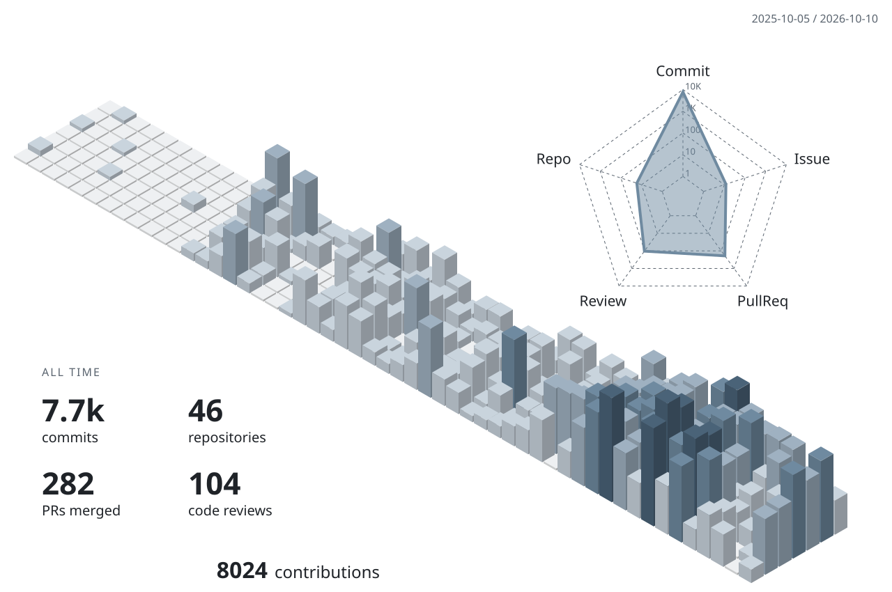
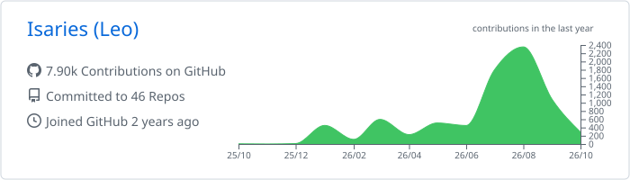
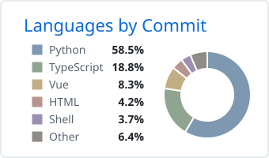
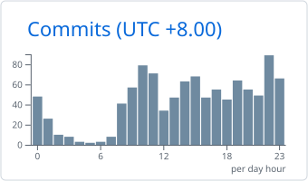

<picture>
  <source media="(prefers-color-scheme: dark)" srcset="https://capsule-render.vercel.app/api?type=waving&height=200&color=0:0d1117%2C100:56708a&text=Chen-Wei%20Huang&fontColor=ffffff&fontSize=48&fontAlignY=36&desc=Where%20education%20meets%20infrastructure&descSize=18&descAlignY=58" />
  
</picture>

<h1 align="center">Hi, I'm Leo (Chen-Wei Huang)</h1>

  
  
  
  
  

**Software engineer and applied researcher working where education meets infrastructure. I build systems that real classrooms and research groups depend on, and I care about whether they keep working after I hand them over.**

Most of my projects started from a concrete need: a live classroom platform that had to be taken over and kept running, a lab that wanted shared AI infrastructure without scattering API keys across projects, a journal whose editors checked manuscript formatting by hand. My aim in each case is the same: make the system tested, secure, and documented well enough that someone else can operate it after I leave.

> The question I want to study next grows out of that work: how can we tell whether a check that reports success, such as a test, a monitor, or an access rule, is actually protecting anything?

  <picture>
    <source media="(prefers-color-scheme: dark)" srcset="./assets/hero-dark.svg" />
    
  </picture>

Taipei, Taiwan · NTNU, [Learning Sciences](https://www.upls.ntnu.edu.tw/) (cognitive science and HCI applied to how people learn), double major in Computer Science · Senior, graduating 2027  
GPA 4.01 / 4.3 · Department rank 2 of 14 · Academic Achievement Award · NTNU Programming Project Competition, Project Distinction Award (x2)  
[cw.huang.work@gmail.com](mailto:cw.huang.work@gmail.com) · Mandarin (native) · English

<picture>
  <source media="(prefers-color-scheme: dark)" srcset="./profile-3d-contrib/profile-night-green.svg" />
  
</picture>

---

## Highlights

<table>
  <tr>
    <td align="center" width="150"><h3>13</h3>upstream PRs</td>
    <td><b>13 pull requests merged upstream</b> into UC Berkeley's <a href="https://github.com/WISE-Community">WISE</a> platform (11 in WISE-API, 2 in WISE-Client): 10 security or user-facing behavior fixes and 3 test follow-ups, shipped in the project's regular releases</td>
  </tr>
  <tr>
    <td align="center"><h3>ICCE 2026</h3>first author</td>
    <td><b>Research</b>: first-author paper accepted at ICCE 2026; first-author journal manuscript in preparation</td>
  </tr>
  <tr>
    <td align="center"><h3>Live</h3>production systems</td>
    <td><b>Production systems</b> built and operated for live classrooms and active research groups, alongside coursework, research, and teaching</td>
  </tr>
  <tr>
    <td align="center"><h3>~100</h3>workshop participants</td>
    <td><b>Instructor &amp; TA</b>: AI-agent design workshops at 3 institutions for about 100 participants, mostly in-service teachers; TA for SQL &amp; Database Design</td>
  </tr>
  <tr>
    <td align="center"><h3>9</h3>RA appointments</td>
    <td><b>9 research assistant appointments</b> since 2023-09, under 4 PIs (Profs. <a href="https://www.nschen.net">Nian-Shing Chen</a>, <a href="https://orcid.org/0000-0003-0229-5079">Yu-Ju Lan</a>, <a href="https://web.ntnu.edu.tw/~hychang/">Hsin-Yi Chang</a>, and <a href="https://scholar.lib.ntnu.edu.tw/en/persons/cheng-chih-wu/">Cheng-Chih Wu</a>), funded by NSTC, MOST, and MOE</td>
  </tr>
</table>

<strong>Awards</strong> (5)

- **Academic Achievement Award** (書卷獎), NTNU, fall 2025 semester
- **STAR Scholarship** (STAR 星辰獎學金), NTNU, spring 2026 semester
- **Project Distinction Award** (專題特優獎), NTNU General-Education Programming Project Competition, 11th and 12th editions, 2024
- **Five-Fold Education Scholarship, Moral Education Award** (五育獎學金－德育獎), NTNU, 2024
- **Statistical Science Camp**, Institute of Statistical Science, Academia Sinica, 2025 (completed)

<strong>Certifications</strong> (2)

- **TCSOL Professional Teaching Certification** (Teaching Chinese to Speakers of Other Languages), Institute of Chinese Language Teaching (ICLT, 全球漢語教學總會), 2024
- **Diploma in Teaching Chinese to Speakers of Other Languages (Level 3)**, TQUK-endorsed, International Han Institute, 2024: completed a 66-hour Chinese teacher training program (2024-03 to 2024-05) covering phonetics, characters, Pinyin and Zhuyin, sentence patterns, grammar teaching, and second-language learning

---

## Skills

  <picture>
    <source media="(prefers-color-scheme: dark)" srcset="https://skillicons.dev/icons?i=py%2Cts%2Crust%2Cjava%2Cc%2Cfastapi%2Cflask%2Cspring%2Cvue%2Creact%2Cnextjs%2Cangular%2Ctailwind%2Cvite%2Cpostgres%2Cmysql%2Credis%2Csqlite%2Cpytorch%2Cdocker%2Cnginx%2Ccloudflare%2Cgithubactions%2Cbash&perline=12&theme=dark" />
    
  </picture>

**Languages:** Python · TypeScript · Rust · SQL · C · Java  
**Backend:** FastAPI · Flask · Spring Boot · SQLAlchemy · Pydantic · Celery  
**Frontend:** Vue 3 · React · Next.js · Angular · Tailwind · Vite  
**Data:** PostgreSQL · MySQL · Redis · Qdrant · Neo4j · SQLite  
**AI/ML:** OpenAI · Anthropic · MCP · RAG · GraphRAG · PyTorch Geometric · XGBoost  
**Infra:** Docker · gVisor · Nginx · Cloudflare · GitHub Actions · Bash  
**Engineering:** System design · API design · Testing strategy · CI/CD  
**Security & Ops:** Access control · Sandboxing · Secrets management · Monitoring & alerting · Disaster recovery

---

## GitHub Activity

  <picture>
    <source media="(prefers-color-scheme: dark)" srcset="./profile-summary-card-output/github_dark/0-profile-details.svg" />
    
  </picture>

  <picture>
    <source media="(prefers-color-scheme: dark)" srcset="./profile-languages/languages-dark.svg" />
    
  </picture>
  <picture>
    <source media="(prefers-color-scheme: dark)" srcset="./profile-summary-card-output/github_dark/4-productive-time.svg" />
    
  </picture>

Languages: each repository's commits are split by that repository's language mix, across personal, organization and private repositories.

---

## Featured Work

### TWISE: Production Platform Operations

  

*Sole developer and operator on the university side for NTNU's deployment of UC Berkeley's WISE science-learning platform, which serves secondary-school science classes in Taiwan. (Private repos under [WISE-NTNU-Community](https://github.com/WISE-NTNU-Community).)*

Took over the platform in July 2026 and, over 41 active days, brought 15 repositories under version control, built 3 CI/CD pipelines, and built an administration dashboard with 953 backend and 446 frontend tests. Problems found along the way that also affected upstream were fixed at the source: 13 pull requests reviewed and merged by Berkeley's maintainers, including administrator-only enforcement for user and account management ([#322](https://github.com/WISE-Community/WISE-API/pull/322)), a run-ownership check on batch group password resets ([#325](https://github.com/WISE-Community/WISE-API/pull/325)), a check that a student belongs to the run before their password can be changed ([#332](https://github.com/WISE-Community/WISE-API/pull/332)), and atomic project saves that prevent corrupted project files under rapid editing ([#358](https://github.com/WISE-Community/WISE-API/pull/358)).

**Stack:** Java · Spring Boot · Angular · FastAPI · Next.js · PostgreSQL · MySQL · Docker · GitHub Actions

### [SMAP](https://github.com/Research-Center-for-Smart-Learning-RCSL/Smart-MultiAgent-Platform): Multi-Agent LLM Platform

  

*Platform for an NSTC-funded undergraduate research project. Sole developer; in active development.*

Lets researchers define LLM agents, compose them into workflows, ground them in documents, give them sandboxed tools, and audit what happened, without writing code. 14 domain modules, 364 REST endpoints, 8 WebSocket channels, 8,400+ backend tests, 1,800+ frontend tests. Includes a visual workflow editor with a hand-written expression language, gVisor-sandboxed tool execution, envelope-encrypted bring-your-own API keys, and RAG + GraphRAG with cross-store consistency.

**Stack:** Python · FastAPI · TypeScript · Vue 3 · PostgreSQL · Redis · Qdrant · Neo4j · Docker · gVisor

### [AI Nexus](https://github.com/Research-Center-for-Smart-Learning-RCSL/RCSL-AI-Nexus): Self-Hosted LLM Gateway

  

*Sole developer. In production on a lab Mac Studio, giving the lab shared AI infrastructure without per-project API keys and model configs.*

LLM inference gateway with an OpenAI-compatible API, a management control plane, multi-runtime support (Ollama, MLX, vLLM), key management, spend controls, and health monitoring with alerting. 91 endpoints, ~1,500 tests, 12 Compose services. Verified by actually rebooting the host to confirm unattended recovery and by restore drills. Recent additions include a Rust/PyO3 native tokenizer that reads GGUF model files directly for token counting and chat-template rendering, and a model-evaluation harness with multi-seed rotation and quantization-matched comparisons for production model selection.

**Stack:** Python · Rust (PyO3) · FastAPI · TypeScript · React · PostgreSQL · Docker · launchd

---

## Other Projects

| Project | What it does |
|---|---|
| [**AI3L**](https://github.com/ISW-stack/AI3L-Community) | Academic-exchange community platform (forum, Q&A, events, DMs, admin suite) in 17 locales. Lead developer of a two-person team: 588 of 604 commits, 205 endpoints |
| **Hybrid Copyediting System** | Formatting checker for the SSCI journal *Educational Technology & Society*: 163 requirements distilled into 47 rules for citations, references, and journal style; writes findings back as Word comments via raw OOXML |
| [**Fishbone Cave**](https://github.com/Isaries/fishbone) | Multi-device classroom creativity activity. In a four-day sprint, added a self-hosted room server and deployment path to a colleague's project, and ported and reviewed its AI review service |
| [**Math Defense**](https://github.com/2026-NTNU-Computer-Programming-II-POLS/Math-Defense) | Tower-defense game where math operations are the controls, with a deterministic C99/WASM scoring kernel replayed server-side for anti-cheat. 3-person team, technical lead |
| **ETF Co-Ownership Networks** | Capstone (3-person team, defense 2026-12): do debiased ETF co-ownership networks improve out-of-sample prediction of Taiwan stock returns? Built the audited, reproducible 17-stage pipeline: 16.5M panel rows, a pre-specified Ridge model with tree and GAT comparisons, Clark-West tests over 2018–2025, and 132 robustness variants checked against permutation placebos. Result: no detectable predictive gain, reported as falsification evidence; paper in revision |
| [**NOJ**](https://github.com/2025-NTNU-Software-Engineering-Team-1/new-front-end-2025Team1) | Online judge used in NTNU CS courses. Front-end contributor: consolidated PR #14 (81 files), sandbox rule editor, i18n including Taiwanese Hokkien |
| **SQL Client** | SQL middleware with AST-based query validation, database-scope access control, and SSRF prevention |

<strong>Collaboration</strong>

- **WISE upstream**: authored 13 pull requests that Berkeley's maintainers reviewed and merged across two repositories; disclosed security fixes in the pull requests after confirming neither repository had a private reporting channel
- **Fishbone Cave**: worked inside a colleague's project structure and agreed feature boundaries with the owner during a four-day sprint
- **NOJ**: contributed to a multi-developer production codebase used by CS courses

---

## Research & Publications

**First author** · "Generative AI as a Socratic Tutor in Robot-Assisted Language Learning: Multidimensional Usability Costs and Attitudinal Outcomes" · *ICCE 2026* (accepted)  
Compares three LLM tutoring agents that teach English grammar on a robot-and-tablet platform, with 32 ninth-grade EFL learners.

**First & corresponding author** · "Three LLM-Driven AI Agents on a Robot-and-Tablet Platform for EFL Grammar Learning: An Exploratory Pilot" · journal manuscript in preparation

<strong>Research experience</strong> (9 appointments since 2023-09)

| Period | Role |
|---|---|
| 2026-08 – 2026-12 | RA, MOE project (Prof. Nian-Shing Chen) |
| 2026-07 – 2027-07 | Platform developer & operator, TWISE, NSTC project (Prof. Hsin-Yi Chang) |
| 2026-07 – 2027-02 | **NSTC Undergraduate Research Project**, sole developer of SMAP (advisor: Prof. Nian-Shing Chen) |
| 2026-07 – 2026-08 | RA, MOE Higher Education Sprout Project, journal submission-system work (Prof. Yu-Ju Lan), 2 appointments |
| 2026-02 | RA, NSTC project (Prof. Yu-Ju Lan) |
| 2026-01 – 2026-06 | RA, NSTC project (Prof. Nian-Shing Chen) |
| 2025-07 – 2025-12 | RA, MOE project (Prof. Nian-Shing Chen): NLP, MCP, workflow automation |
| 2025-02 – 2025-06 | RA, MOST project (Prof. Nian-Shing Chen): NLP, HCI, AI agents |
| 2023-09 – 2024 | RA, ICILS 2023 Taiwan team (Prof. Cheng-Chih Wu) |

<strong>Teaching & Mentoring</strong>

| When | What |
|---|---|
| 2026-09 – 2026-12 | **Teaching assistant**, SQL & Database Design, NTNU |
| 2026-01 – 2026-03 | **Instructor**, AI-agent design workshops at 3 institutions (about 100 participants, mostly in-service teachers) |
| 2024 | **Programming instructor**, Python, Fuhe Junior High School |
| 2023 – 2024 | **Digital tutor**, MOE Digital Companion program |

---

## What's Next

I'm applying to master's programs for 2027 entry. The research direction I want to pursue comes from the systems above: telling apart checks that genuinely guard a system from checks that pass no matter what, in tests, monitoring, and access control.

Reach me at [cw.huang.work@gmail.com](mailto:cw.huang.work@gmail.com).

---

*Last updated: 2026-10-07*

<picture>
  <source media="(prefers-color-scheme: dark)" srcset="https://capsule-render.vercel.app/api?type=waving&height=100&color=0:56708a%2C100:0d1117&section=footer" />
  
</picture>
